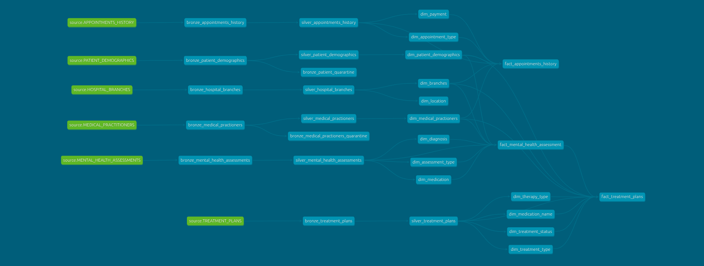

# Healthcare ETL Pipeline

## Overview

This project implements a **Healthcare ETL pipeline** that extracts, loads, and transforms raw data from local sources into **Snowflake**, leveraging **S3 for storage** and **dbt for transformations**. The pipeline is orchestrated using **Dagster** and implements a **medallion architecture** with Bronze, Silver, and Gold layers.

---

## Architecture & Data Flow

### Data Extraction
- Source files are stored locally.  
- Extraction scripts upload files to **AWS S3** using **Boto3**.  
- Metadata is maintained locally to **track processed files**, ensuring **idempotency** (i.e., files are not reprocessed).

### Data Loading
- Extracted files from S3 are loaded into **Snowflake** using the **Snowflake Connector for Python**.  
- After loading, **file metadata is saved as Parquet files**, providing a reference for already processed files.

### Data Transformation with dbt
- **Bronze Layer**: Stores raw data in Snowflake.  
- **Silver Layer**: Performs transformations to clean and structure data.  
  - **Note**: Currently, ~30% of source data is being cleaned unintentionally.  
- **Gold Layer**: Creates **dimension tables** and **fact tables** with **SCD2 (Slowly Changing Dimension Type 2)**.  
  - Dimension tables connect to multiple fact tables.  
  - Fact tables share common dimension tables for consistency.  
  - **Current issue**: Gold layer transformations are not fully idempotent.

### Orchestration
- **Apache Airflow** is used to orchestrate the pipeline.  
- Tasks are scheduled **daily** with:
  - `catchup=False`
  - `retries=1`  
- The DAG runs all three layers in sequence: **Bronze → Silver → Gold**.

---

## Tools & Technologies

| Layer / Task          | Tool / Library                               |
|-----------------------|----------------------------------------------|
| ETL Extraction        | Python, Boto3                                |
| ETL Loading           | Python, Snowflake Connector                  |
| Transformations       | dbt                                          |
| Orchestration         | Dagster                                      |
| Storage               | S3 (raw/extracted files), Snowflake (processed data) |
| Metadata Tracking     | Parquet and csv files                        |
| Pipeline Design       | Medallion Architecture (Bronze, Silver, Gold)|

---

## Current Limitations / Issues
- **Gold Layer** is not fully idempotent.  
- **Silver Layer** currently removes ~30% of source data unintentionally.  
- **dbt Tests** are not yet implemented.

---

## How to Run

### Setup Environment
```bash
# Activate virtual environment
source my_venv/bin/activate

# Install dependencies
pip install -r requirements.txt
```
---

## Run Dagster
```bash
#start the dagster
dg dev

```
- The DAG will orchestrate the Bronze → Silver → Gold layers automatically

### Future Improvements

- Make **Gold Layer idempotent**.

- Fix **data loss in Silver Layer**.

- Add **dbt tests** for data quality and validation.

- Implement **CI/CD** for automated deployments.


### Pipeline Architecture


### dbt lineage graph

